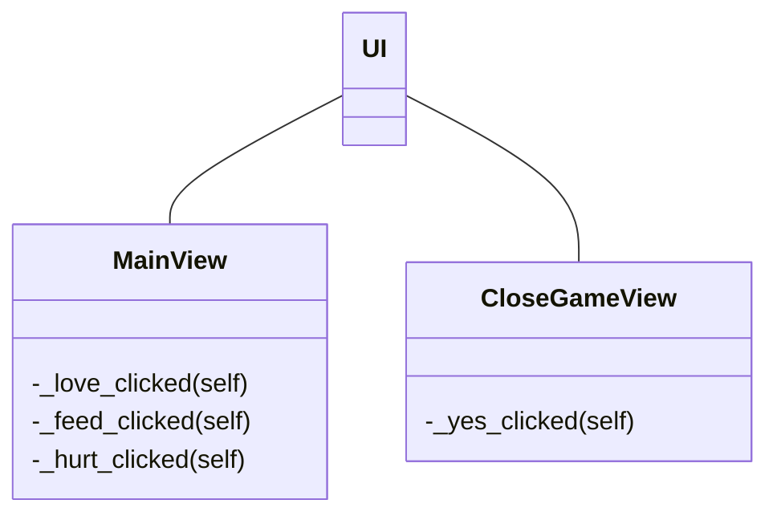
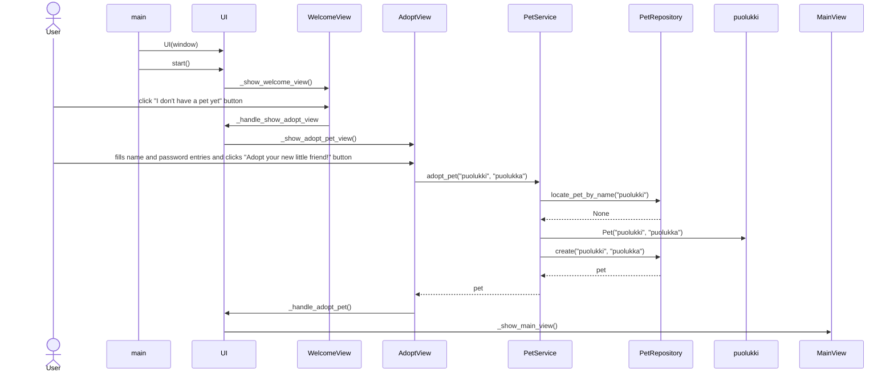

# Sovelluksen arkkitehtuuri

## Rakenne

Kansio [ui](https://github.com/macabre-cs/ot-harjoitustyo/tree/master/src/ui) sisältää koodit, jotka vastaavat sovelluksen käyttöliittymästä ja sovelluksen toiminnallisuudesta.

## Käyttöliittymä

Käyttöliittymässä on 2 eri näkymää:

- Pelin päänäkymä (itse peli)
- Pelin sulkeminen

## Sovelluslogiikka

Sovelluksen [UI-luokka](https://github.com/macabre-cs/ot-harjoitustyo/blob/master/src/ui/ui.py) on vastuussa eri näkymien näyttämisestä ja piilottamisesta. Luokat [MainView](https://github.com/macabre-cs/ot-harjoitustyo/blob/master/src/ui/main_view.py) ja [CloseGameView](https://github.com/macabre-cs/ot-harjoitustyo/blob/master/src/ui/close_game_view.py) taas vastaavat omien näkymiensä toiminnallisuuksista (esimerkiksi nappien painamisesta).

## Sovelluksen toiminnallisuus

*tähän kiva teksti sovelluksen toimintalogiikasta*

### Virtuaalilemmikin luominen

Sovelluksen avautuessa käyttäjän voi adoptoida uuden lemmikin painamalla nappia ''I dont't have a pet yet'', joka vie käyttäjän uuteen näkymään, jossa käyttäjä syöttää lemmikin nimen ja salasanan. Painamalla ''Adopt your new little friend!'' käyttäjä kirjataan sisään sovellukseen uudella lemmikillään.

*UI-luokka kutsuu sisällään eri näkymiä vaihtavia metodeja, mutta halusin kuvata sen seuraavalla tavalla sekvenssikaaviossa, koska muuten kaaviosta olisi tullut kovin tuhti ja sekava.*

Auki kirjoitettuna käyttäjän avattua sovelluksen ja painettua "I don't  have a pet yet" nappia, käyttäjä syöttää lemmikin nimen ja salasanan niille osoitetuille kentille ja painaa "Adopt your new little friend!" nappia. Tämän jälkeen PetService-luokka tarkistaa PetRepository luokalta, onko tämän niminen lemmikki jo tietokannassa. Tässä tapauksessa ei ole joten PetRepository-luokka palauttaa None. PetService kutsuu Pet-luokkaa, jossa luodaan puolukille Pet-olio. Sen jälkeen PetService-luokka kutsuu PetRepository-luokkaa, jossa kirjataan tietokantantaan uusi lemmikki puolukki, jonka jälkeen PetRepository luokka palauttaa sen takaisin PetService luokalle. Tämän jälkeen käyttäjälle avautuu pelin päänäkymä, jossa on hänen virtuaalilemmikkinsä.
