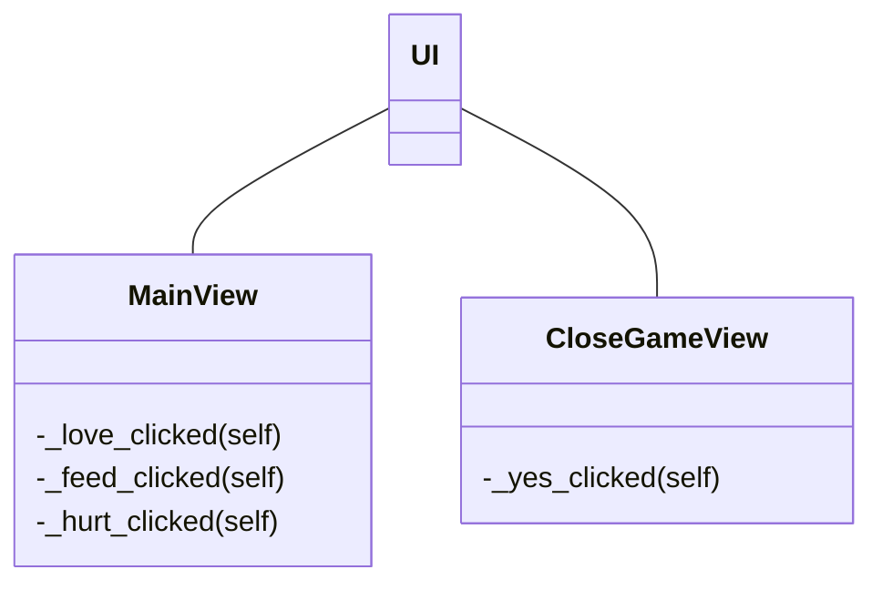

# Sovelluksen arkkitehtuuri

## Rakenne

Kansio [ui](https://github.com/macabre-cs/ot-harjoitustyo/tree/master/src/ui) sisältää koodit, jotka vastaavat sovelluksen käyttöliittymästä ja sovelluksen toiminnallisuudesta.

## Käyttöliittymä

Käyttöliittymässä on 2 eri näkymää:

- Pelin päänäkymä (itse peli)
- Pelin sulkeminen

## Sovelluslogiikka

Sovelluksen [UI-luokka](https://github.com/macabre-cs/ot-harjoitustyo/blob/master/src/ui/ui.py) on vastuussa eri näkymien näyttämisestä ja piilottamisesta. Luokat [MainView](https://github.com/macabre-cs/ot-harjoitustyo/blob/master/src/ui/main_view.py) ja [CloseGameView](https://github.com/macabre-cs/ot-harjoitustyo/blob/master/src/ui/close_game_view.py) taas vastaavat omien näkymiensä toiminnallisuuksista (esimerkiksi nappien painamisesta).

## Sovelluksen toiminnallisuus

*tähän kiva teksti sovelluksen toimintalogiikasta*

### Virtuaalilemmikin luominen

Sovelluksen avautuessa käyttäjän voi adoptoida uuden lemmikin painamalla nappia ''I dont't have a pet yet'', joka vie käyttäjän uuteen näkymään, jossa käyttäjä syöttää lemmikin nimen ja salasanan. Painamalla ''Adopt your new little friend!'' käyttäjä kirjataan sisään sovellukseen uudella lemmikillään.

*tähän sekvenssikaavio siitä mitä tapahtuu brrr*
