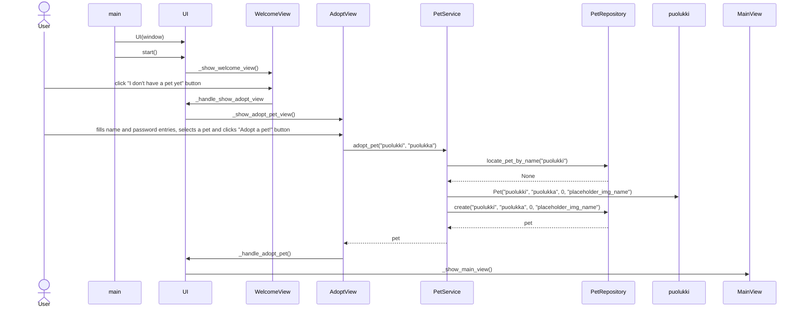
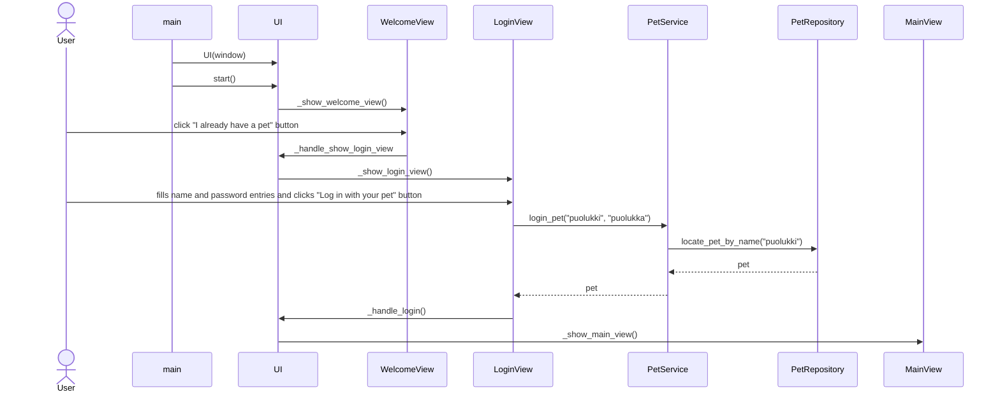

# Sovelluksen arkkitehtuuri

## Rakenne

Kansio [ui](https://github.com/macabre-cs/ot-harjoitustyo/tree/master/src/ui) sisältää koodit, jotka vastaavat sovelluksen käyttöliittymästä ja käyttöliittymälle olennaisesta toiminnallisuudesta (lähinnä napit). Kansio [services](https://github.com/macabre-cs/ot-harjoitustyo/tree/master/src/services) sisältää koodia, joka vastaa sovelluksen käyttäjän ja tietokannan välisestä toiminnallisuudesta. Eli esimerkiksi käyttäjän kirjautumisesta. [Repositories](https://github.com/macabre-cs/ot-harjoitustyo/tree/master/src/repositories)-kansio taas sisältää koodia, joka vastaa tiedon käsittelystä tietokannassa. [Entities](https://github.com/macabre-cs/ot-harjoitustyo/tree/master/src/entities)-kansio sisältää sovelluksen Pet-luokan koodin.

Sovelluksen rakennetta kuvaava kaavio. Kaaviossa on sovelluksen pakkaukset (kansiot) ja niiden sisältämät luokat.

## Käyttöliittymä

Käyttöliittymässä on 5 eri näkymää:

- Aloitusnäkymä
- Lemmikin adoptointinäkymä
- Lemmikin kirjautumisnäkymä
- Päänäkymä
- Sulkemisnäkymä

Eri näkymien näyttämisestä vastaa [UI-luokka](https://github.com/macabre-cs/ot-harjoitustyo/blob/master/src/ui/ui.py). Jokainen näkymä on toteutettu omana luokkanaan. Eri näkymissä kutsutaan [PetService](https://github.com/macabre-cs/ot-harjoitustyo/blob/master/src/services/pet_service.py)-luokan metodeja, jotka ovat vastuussa sovelluslogiikasta. Suurin osa sovelluksen toiminnallisuudesta vastaavasta koodista on eristetty käyttölittymän koodista. Käyttöliittymän koodiin on jätetty sille olennaiset sovelluslogiikkaan liittyvät tehtävät, kuten eri viestilaatikkojen näyttäminen käyttäjälle.

## Sovelluslogiikka

Sovelluksen [UI-luokka](https://github.com/macabre-cs/ot-harjoitustyo/blob/master/src/ui/ui.py) on vastuussa eri näkymien näyttämisestä ja piilottamisesta. Luokat [MainView](https://github.com/macabre-cs/ot-harjoitustyo/blob/master/src/ui/main_view.py) ja [CloseGameView](https://github.com/macabre-cs/ot-harjoitustyo/blob/master/src/ui/close_game_view.py) taas vastaavat omien näkymiensä toiminnallisuuksista (esimerkiksi nappien painamisesta). Sovelluksen muut käyttöliittymään liittyvät näkymät toimivat jokseenkin samoilla periaatteilla. Tietokantaa vaativa toiminnallisuus on eristetty käyttöliittymän toiminnallisuudesta.

Käyttäjälle ja lemmikin tiedoista oleellisesta toiminnallisuudesta vastaa [PetService](https://github.com/macabre-cs/ot-harjoitustyo/blob/master/src/services/pet_service.py)-luokka, joka sisältää esimerkiksi kirjautumiseen ja tietokannasta tiedon hakemiseen liittyviä toimintoja. [PetRepository](https://github.com/macabre-cs/ot-harjoitustyo/blob/master/src/repositories/pet_repository.py)-luokka taas vastaa tiedon käsittelystä tietokannassa, kuten esimerkiksi virtuaalilemmikin tietojen kirjaamisesta tietokantaan. Luokka [Pet](https://github.com/macabre-cs/ot-harjoitustyo/blob/master/src/entities/pet.py), on luokka joka kuvaa käyttäjän virtuaalilemmikkiä.

[PetService](https://github.com/macabre-cs/ot-harjoitustyo/blob/master/src/services/pet_service.py)-luokan metodit vastaavat siis pääosin sovelluksen loogisen toiminnallisuuden toteuttamisesta. Esimerkiksi metodit:

- `adopt_pet(name, password, progress, pet_img)`
- `login_pet(name, password)`
- `get_progress()`
- `save_progress(progress, name)`
- `get_current_pet()`

Luokka pääsee käsiksi lemmikin tietoihin [PetRepository](https://github.com/macabre-cs/ot-harjoitustyo/blob/master/src/repositories/pet_repository.py)-luokan avulla.

Käyttöliittymän koodissa sille olennaisia loogisia toiminnallisuuksia, jotta koodi pysyisi selkeänä. Sovelluksen kehitysmittarin (progress bar) toiminnallisuus on osittain [MainView](https://github.com/macabre-cs/ot-harjoitustyo/blob/master/src/ui/main_view.py)-luokan vastuulla. Luokka kuitenkin kutsuu [PetService](https://github.com/macabre-cs/ot-harjoitustyo/blob/master/src/services/pet_service.py)-luokkaa tallentaessaan kehitysmittarin arvoja lemmikille tai luodessaan kehitysmittaria (tarkistaa onko lemmikillä jo aikaisempaa kehitystä). Käyttöliittymän koodiissa on myös muita sille olennaisia sovelluslogiikkaan tai muuhun sekalaiseen liittyvää toiminnallisuutta, kuten eri viestilaatikkojen näyttäminen käyttäjälle tai nappien toiminnallisuus.

## Tietojen tallentaminen

[PetRepository](https://github.com/macabre-cs/ot-harjoitustyo/blob/master/src/repositories/pet_repository.py)-luokka on vastuussa tietojen tallentamisesta SQLite-tietokantaan. Virtuaalilemmikin tiedot (nimi, salasana, edistys ja kuva) tallennetaan tietokannassa `pets`-tauluun. Taulu alustetaan [initialize_database.py](https://github.com/macabre-cs/ot-harjoitustyo/blob/master/src/initialize_database.py) tiedostossa, jossa ensin tuhotaan mahdollisesti jo olemassa oleva pets-taulu, ja luodaan uusi tyhjä pets-taulu tilalle. Tietokannan nimi määritellään sovelluksen juuresta löytyvästä [.env](https://github.com/macabre-cs/ot-harjoitustyo/blob/master/.env)-konfiguraatiotiedostossa.

## Sovelluksen toiminnallisuus

Sovelluksessa on kahdenlaisia toiminnallisuuksia.

- **Pelaamiselle** olennaiset toiminnallisuudet kuten virtuaalilemmikin ruokkimen ja helliminen.
- Virtuaalilemmikin **tietojen tallentamiselle** olennaiset toiminnallisuudet kuten lemmikin adoptoiminen ja lemmikin sisään kirjaaminen.

### Pelaaminen

Sovelluksen viehättävin toiminnallisuus eli pelaaminen on varsin simppeliä. Käyttäjä voi painaa eri nappeja, jotka tekevät eri asioita. Painamalla nappia `Love` sovellus arpoo yhden mahdollisista hellimisen muodoista ja näyttää käyttäjälle viestilaatikon, joka kertoo käyttäjälle mitä hän teki. Hellimisestä saa myös pisteitä, jotka edistävät lemmikin kiintymystä käyttäjään. Kehitystä kuvaa pelinäkymässä oleva mittari. Lemmikin ruokkiminen toimii samalla tavalla kuin helliminen, siitä saa tosin vähemmän pisteitä. Mikäli käyttäjä hellii ja ruokkii lemmikkiään tarpeeksi (eli mittarin täytyttyä) käyttäjälle näytetään viestilaatikko, jossa ilmaistaan lemmikin kiintymys käyttäjään. Käyttäjä voi myös halutessaan satuttaa lemmikkiään painamalla `Hurt :(`-nappia. Sovellus rankaisee käyttäjää vahvasti sammuttamalla koko ohjelman ja poistamalla lemmikin tietokannasata. Käyttäjälle näytetään myös tämän tapahtuessa viestilaatikko, joka toruu käyttäjää. Viestilaatikon sisältö on jälleen arvottu satunnaisesti eri vaihtoehdoista.

### Virtuaalilemmikin luominen

Sovelluksen avautuessa käyttäjän voi adoptoida uuden lemmikin painamalla nappia ''I dont't have a pet yet'', joka vie käyttäjän uuteen näkymään, jossa käyttäjä syöttää lemmikin nimen ja salasanan. Käyttäjän tulee myös valita minkä lemmikin valitsee kolmesta eri [vaihtoehdosta](https://github.com/macabre-cs/ot-harjoitustyo/tree/master/data/graphics). Painamalla ''Adopt a pet!''-nappia käyttäjä kirjataan sisään sovellukseen uudella lemmikillään.

*UI-luokka kutsuu sisällään eri näkymiä vaihtavia metodeja, mutta halusin kuvata sen seuraavalla tavalla sekvenssikaaviossa, koska muuten kaaviosta olisi tullut kovin tuhti ja sekava.*

Auki kirjoitettuna käyttäjän avattua sovelluksen ja painettua "I don't  have a pet yet" nappia, käyttäjä syöttää lemmikin nimen ja salasanan niille osoitetuille kentille, valitsee lemmikin ja painaa "Adopt a pet!" nappia. Tämän jälkeen PetService-luokka tarkistaa PetRepository luokalta, onko tämän niminen lemmikki jo tietokannassa. Tässä tapauksessa ei ole joten PetRepository-luokka palauttaa None. PetService kutsuu Pet-luokkaa, jossa luodaan puolukille Pet-olio. Sen jälkeen PetService-luokka kutsuu PetRepository-luokkaa, jossa kirjataan tietokantantaan uusi lemmikki puolukki, jonka jälkeen PetRepository luokka palauttaa sen takaisin PetService luokalle. Tämän jälkeen käyttäjälle avautuu pelin päänäkymä, jossa on hänen virtuaalilemmikkinsä.

### Sisäänkirjautuminen

Sovelluksen avautuessa käyttäjän voi kirjautua sisään luodulla lemmikillään painamalla nappia ''I already have a pet'', joka vie käyttäjän uuteen näkymään, jossa käyttäjä syöttää lemmikin nimen ja salasanan. Käyttäjä kirjataan sisään, jos kirjautuminen onnistuu ja sovellus avaa käyttäjälle pelin päänäkymän, jossa on hänen luomansa lemmikki.

*UI-luokka kutsuu sisällään eri näkymiä vaihtavia metodeja, mutta halusin kuvata sen seuraavalla tavalla sekvenssikaaviossa, koska muuten kaaviosta olisi tullut kovin tuhti ja sekava.*

Auki kirjoitettuna käyttäjän avattua sovelluksen ja painettua "I already have a pet" nappia, käyttäjä syöttää lemmikin nimen ja salasanan niille osoitetuille kentille ja painaa "Log in with your pet" nappia. Tämän jälkeen PetService-luokka tarkistaa PetRepository luokalta, onko tämän niminen lemmikki tietokannassa. Tässä tapauksessa on, joten PetRepository-luokka palauttaa lemmikin Pet-olion. Sen jälkeen PetService palauttaa lemmikin Pet-olion takaisin LoginView-luokalle, jossa kutsutaan käyttäjän kirjautumismetodia. Käyttäjälle avautuu pelin päänäkymä, jossa on hänen virtuaalilemmikkinsä.

### Muu toiminnallisuus

Eri näkymien tapahtumankäsittelijät kutsuvat [PetService](https://github.com/macabre-cs/ot-harjoitustyo/blob/master/src/services/pet_service.py)-luokan metodeja tarvittaessa, kuten lemmikin kehityksen tallentamisessa tai lemmikin uloskirjaamisessa. Käyttöliittymä vastaa näkymien näyttämisestä ja niiden välisestä toiminnallisuudesta esim. näkymästä toiseen siirtyminen.

## Sovelluksen heikkoudet

### Käyttöliittymä ja rakenne

Käyttöliittymä on osittain liian sidottu sovelluksen toiminnallisuuteen. Moni oleellinen asia, on kiinni käyttöliittymän koodissa, joka hankaloittaa sovelluslogiikan testaamista. Eri näkymien luokkien koodi ei myöskään ole kovin yhtenäistä, koska olen testaillut eri asioita eri näkymissä. Tämä tekee koodista hankalampaa ymmärtää.
