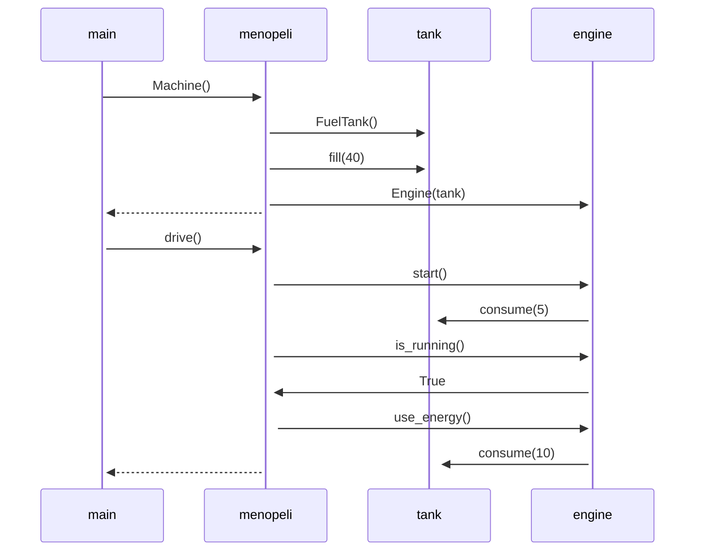

```mermaid
sequenceDiagram
    main->>+menopeli: Machine()
    menopeli->>+tank: FuelTank()
    menopeli->>+tank: fill(40)
    menopeli->>+engine: Engine(tank)
    menopeli-->>+main:   
    main->>+menopeli: drive()
    menopeli->>+engine: start()
    engine->>+tank: consume(5)
    menopeli->>+engine: is_running()
    engine->>+menopeli: True
    menopeli->>+engine: use_energy()
    engine->>+tank: consume(10)
    menopeli-->>+main:     
```
