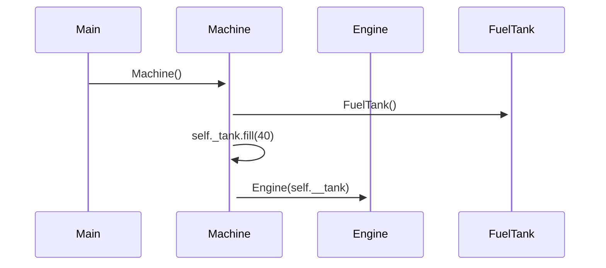

```mermaid
sequenceDiagram
    participant Main
    participant Machine
    participant Engine
    participant FuelTank
    
    Main->>+Machine: Machine()
    Machine->>+FuelTank: FuelTank()
    Machine->>+Machine: self._tank.fill(40)
    #Fueltank->>+Machine: fill(40)
    Machine->>+Engine: Engine(self.__tank)


```
